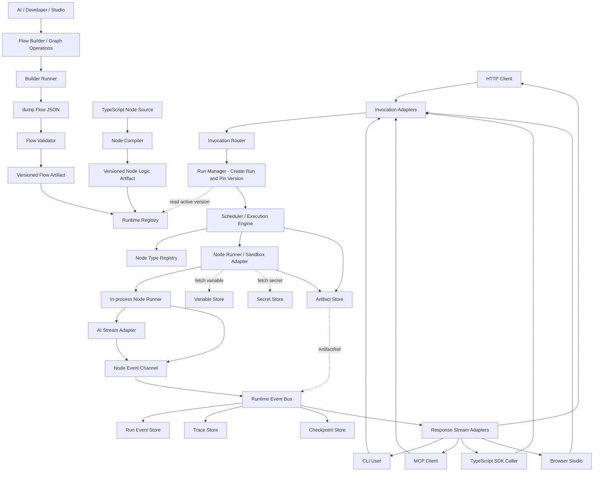

# AI Native Flow Runtime Architecture

## 1. 文档定位

本文件是 **AI Native Flow Runtime** 的架构总览和文档入口。

详细接口、执行语义、实现步骤和验收标准已经拆分到 `docs/` 下的专题文档。本文件只保留项目目标、核心原则、总体架构、关键决策和阅读路径，避免后续让 AI 开发时反复读取一份过长的混合文档。

如果要实现代码，应优先阅读：

- [AI Implementation Guide](docs/implementation/ai-implementation-guide.md)
- [Roadmap](docs/implementation/roadmap.md)
- 对应模块的 `docs/specs/*` 规格文档

---

## 2. 项目目标

本项目目标是构建一个 **AI-native Agent Harness / Flow Runtime**，用于支持 AI 通过 `Flow Builder` 或 `Graph Operation` 生成、修改、调试和热更新可控的 Agent Flow。

它要解决的问题包括：

- **Flow 可热更新**：支持不停机新增、替换、灰度和回滚 Flow。
- **节点逻辑可热更新**：支持替换节点 Prompt、配置和 TypeScript 逻辑。
- **多入口调用**：同一个 Flow 可通过 HTTP、CLI、MCP、SDK 调用。
- **可视化协作编辑**：Studio 不只是浏览 AI 生成结果，还要支持用户拖拽、添加、删除节点和连接多端口边。
- **稳定流式输出**：AI SDK、AI Coding IDE SDK、外部 CLI Agent 和 Python sidecar 的输出必须归一化为事件流，不能依赖 `stdout` / `stderr` 作为语义 token stream。
- **AI 安全参与开发**：AI 生成 `Flow Builder` 逻辑、`Graph Operation` 或受限节点代码，但不能直接修改核心 Runtime。
- **生产环境可控**：支持版本化 Artifact、Run Version Pinning、Checkpoint、Replay、权限控制、Secret Scope 和 Sandbox。

---

## 3. 核心原则

### 3.1 Flow as Data

Flow 必须是稳定、可版本化、可校验的图模型。

关键要求：

- 节点实例必须有稳定唯一 `id`。
- 边必须连接具体 `{ nodeId, portId }`，不能只连接节点。
- 端口是一等概念，支持 `control`、`data`、`event`、`stream`、`error`。
- Runtime Graph Schema 与 Editor View Model 必须分离。
- React Flow 等前端库只能作为 Studio 适配层，不能成为运行时契约。
- **控制流语义是 Schema 的一部分**：Fork / Join、`parallel`、`subflow`、`loop`、条件分支、错误分支必须通过显式节点类型或端口声明表达，不能依赖执行顺序、布局位置或隐式约定。多输入合并、循环最大迭代次数、并行失败策略等都必须在图中显式落到 Node Type 或端口配置上。

详细规格见 [Flow Graph Schema](docs/specs/flow-graph-schema.md)，执行语义见 [Runtime Execution §5.6](docs/specs/runtime-execution.md)。

### 3.2 Flow Builder First

Flow JSON 是存储、交换、版本化和运行时加载格式，**不是 AI 的主要生成目标**。

AI 应优先生成：

- 类型化 `Flow Builder` 逻辑。
- 小粒度 `Graph Operation`。
- 受控 Sandbox Code。

最终 JSON 必须由 `dump()` 统一导出，并经过 Validator 校验。

详细规格见：

- [Flow Builder](docs/specs/flow-builder.md)
- [Graph Operations](docs/specs/graph-operations.md)

### 3.3 Versioned Runtime

生产热更新不能依赖开发态 HMR。

核心策略：

- Flow Artifact 版本化。
- Node Logic Artifact 版本化。
- Registry 原子 Promote。
- Run 创建时固定 Flow Version。
- 旧 Run 使用旧 Artifact，新 Run 使用新 Artifact。

详细规格见：

- [Runtime Execution](docs/specs/runtime-execution.md)
- [Runtime Hot Swap Decision](docs/decisions/runtime-hot-swap.md)

### 3.4 Node Event Channel First

节点通信和 AI 流输出必须走标准事件通道。

关键要求：

- 语义流不能混在日志流中。
- `stdout` / `stderr` 只作为诊断日志采集。
- AI SDK 原始流必须通过 `AI Stream Adapter` 转换为 `NodeEvent`。
- HTTP、CLI、MCP、SDK、Studio 必须消费同一条 `Runtime Event Bus`。
- 跨进程通信需要帧协议、序号、ACK、心跳、取消和背压。

详细规格见：

- [Streaming and Node Communication](docs/specs/streaming-and-node-communication.md)
- [Event Channel Instead of stdout Decision](docs/decisions/event-channel-instead-of-stdout.md)

### 3.5 Node-first, Runtime-neutral

项目使用 Node.js LTS、npm workspaces、`tsx` 和 Vitest 跑通开发、测试、脚本和本地示例链路；对外默认 Runtime 必须保持 portable，不能绑定 runtime-only API。

推荐定位：

- Node.js LTS 用于包管理、脚本、测试、本地开发、Builder Runner 和 CLI。
- `@ai-native-flow/runtime` 包根导出 portable `createRuntime()`，业务层无需感知具体平台。
- `@ai-native-flow/runtime/node` 显式导出 `createNodeRuntime()`；只有 Node CLI、HTTP runner 和 desktop-power sidecar 使用该入口。
- `/portable` 是基础设施的显式 portable 入口，`/browser` 仅作为兼容别名保留。
- Runtime Core 保持 runtime-neutral TypeScript / ESM；Node 文件、进程和 ArtifactStore 只能从 `/node` 到达。
- portable 与 Node 组合均默认注入 capability manifest，在 Flow 注册和解析阶段执行能力预检。
- Sandbox Adapter 当前只内置 in-process 实现，用于可信团队代码的统一执行、try/catch 错误归一、协作式 timeout / cancel 和 `drainAndUnregister`；Worker、子进程、容器隔离暂不作为项目目标，除非未来引入不可信第三方节点。
- MCP、Trace、数据库、队列等生产依赖优先做 Node 兼容性验证。

详细决策见 [Node-first, Runtime-neutral](docs/decisions/node-first-runtime-neutral.md)。

### 3.6 Variable / Secret / Sandbox as First-class

配置、凭据与执行隔离不是附加在节点逻辑上的辅助能力，而是 Runtime 的三条一等抽象，且**配置与凭据必须分轨**。

关键要求：

- **配置与凭据双轨分离**：非敏感配置走 `VariableStore`（可枚举、可日志、可写入 Trace、可在 Flow JSON 中以 `{ "$var": "NAME" }` 引用）；敏感凭据走 `SecretStore`（不可枚举值、`SecretValue` 包装、`toString()` / `toJSON()` 自动脱敏、Flow JSON 中只允许 `{ "$secret": "NAME" }` 命名引用）。两条 Store 不允许互相回退，禁止把所有内容塞进 `process.env` 一个袋子。
- 节点只能通过 `ctx.variables.get(name)` 与 `ctx.secrets.get(name)` 在运行时拉取被授权的值，AI 生成的代码默认不能直接访问 `process.env`。
- Secret 不进入 Flow JSON、Node Config、Run State、Run Event、Trace 或 Studio 明文视图。
- Variable 可以进入 Flow JSON、Run Event 与 Studio 视图，但仍受 Workspace / Project / Flow 的 scope 约束（详见 [Workspace Model](docs/specs/workspace-model.md)）。
- 每个 Node Type Manifest 必须显式声明 `requiredPermissions`、`requiredSecrets`、`requiredVariables` 和最小 scope。
- 任何 AI 生成或外部贡献的节点逻辑都必须通过 Sandbox Adapter 执行，禁止旁路。
- Sandbox 在当前可信单租户范围内不承诺恶意代码隔离；默认策略是 in-process 执行 + 权限元数据 + `try/catch` 错误归一 + 协作式 timeout / cancel。文件系统、网络、子进程、环境变量、CPU、内存等强隔离不在当前范围内。
- Event、Trace、日志和错误栈在持久化前必须经过脱敏；任何把 `SecretValue` 直接序列化为字符串的代码路径都必须返回 `[secret:NAME]` 占位符而非原值。

双轨实现承载在 `packages/variable-store`（`VariableStore` / `SecretStore` / `bootstrapDefaults` / `$var` / `$secret`）；详细规格见 [Security](docs/specs/security.md)。

---

## 4. 总体架构

总体架构需要同时表达两条主线：

- **构建发布链路**：AI / Developer / Studio 生成 Flow 或节点逻辑，经过校验、编译和版本化发布到 Registry。
- **调用执行链路**：HTTP / CLI / MCP / SDK / Studio 调用 Flow，Invocation Router 解析请求，Run Manager 创建 Run 并固定版本，Scheduler 驱动节点执行，事件流再通过适配器返回调用方。



图例说明：

- 实线箭头表示数据流或控制流方向。
- 虚线箭头表示**只读引用**，例如 Run Manager 启动 Run 时**主动读取**当前 active Flow Version 并 pin 住，Registry 不主动驱动 Run Manager。
- `Builder Runner` 负责执行 Builder 代码（Phase 0 起），`AI Stream Adapter` 负责把厂商 SDK 原始事件归一化为 `NodeEvent`。
- `Artifact Store` 持久化大对象（长文本、文件、patch、二进制），事件流中只携带 `ArtifactRef`。
- `Variable Store` 与 `Secret Store` 是配置 / 凭据双轨：`Variable` 可枚举、可写入 Trace 与 Studio；`Secret` 仅在节点 `ctx.secrets.get()` 时拉取，不进入 Flow JSON、Run State、Run Event、Trace。两者由 `packages/variable-store` 提供统一抽象与默认 `bootstrapDefaults` 装配。
- **执行链路只有一条**：HTTP / CLI / MCP / SDK / Browser Studio 都通过同一组 Invocation Adapters → Invocation Router 进入 Runtime；其中 Browser Studio 的「Run」按钮经由 `@ai-native-flow/transport-http` 的 `/flows/:id/register | invoke | stream` 等标准端点触发，**不存在独立的 Studio 执行路径**。`apps/studio/src/sidecar.ts` 与 `packages/transports/http-runner` 都只是在同一个 `createHttpHandler({ runtime })` 之上挂装饰路由（前者加 `/studio/*` 文件 / 工作区接口，后者加 `GET /` 端点索引），核心 Runtime 与事件总线完全共用。

---

## 5. 模块边界

仓库为 npm workspaces monorepo，根 `package.json` 的 `workspaces` 字段声明了
`packages/*`、`packages/transports/*` 和 `apps/*` 三个工作区根，
对应当前实际目录如下。本节为总览，**单一真相源是 [AI Implementation Guide §3 / §4](docs/implementation/ai-implementation-guide.md)**，本节如与 guide 不一致以 guide 为准。

```text
packages/
  flow-ir/              # 图模型类型与 Schema（Zod + schemaVersion）
  flow-validator/       # 图、端口、Schema 校验
  flow-builder/         # 类型化 Builder、确定性 dump()、AI Patch / Diff Preview / Approval Gate
  builder-runner/       # 执行 Builder 代码并产出 Flow Artifact
  runtime/              # Run Manager、Scheduler、Execution Engine、内部 Registry、内部 Storage 抽象
  event-bus/            # Runtime Event Bus 与持久化事件日志抽象
  node-sdk/             # defineNode / defineNodeFactory / installNode（节点声明唯一入口）
  ai-stream/            # AI Stream Adapter（厂商 SDK -> NodeEvent）
  variable-store/       # VariableStore + SecretStore 双轨抽象，$var / $secret 解析
  sandbox/              # SandboxAdapter 接口与 in-process 实现（Phase 3 引入；可信团队代码执行 seam）
  compiler/             # TypeScript 节点逻辑编译器，产出内容寻址 NodeLogicArtifact（Phase 3 引入）
  workspace-manifest/   # 本项目 apps 自动发现 + 宿主 anf.apps.json 加载 + nodePack 动态 import（被 sidecar / http-runner 共享）
  transport-http/       # Web Fetch (Request)=>Response handler + SSE，被所有 HTTP 服务复用
  studio/               # @ai-native-flow/studio：React + React Flow 编辑器库 (Phase 5)
  transports/
    http-runner/        # 通用 HTTP 服务：发现/读取 app manifests -> 自动 register+promote -> 起 http.Server
    cli/                # transport-cli：run / stream / inspect / replay / cancel
    mcp/                # transport-mcp adapter：tool descriptor / callTool / streamTool
    sdk/                # transport-sdk：createFlowSdkClient + invoke / start / stream / events / replayRun / cancel
apps/
  studio/               # @ai-native-flow/studio-app：Vite 前端 + Node sidecar (apps/studio/src/sidecar.ts)
  code-review-iwiki/    # 业务 app：自定义节点包 + flow JSON + serve/inspect/replay 薄壳脚本
  hello-agent/          # text_input -> agent 最小 app：build / invoke
apps/*/anf.app.json     # app-local 清单：声明本 app 的 flowDirs[] / nodePacks[]
```

本项目自带 apps 由 loader 自动扫描 `apps/*/anf.app.json`，每个 app 目录内的 `anf.app.json` 声明本 app 的 flow root 与 node pack。仓库作为 submodule 使用时，宿主项目可以在宿主根目录提供 `anf.apps.json`，但该文件只声明宿主自己的 `apps[]`；本项目自带 apps 仍由本项目自动发现，宿主不需要声明 submodule 路径。

> 历史遗留：早期文档曾把 HTTP 入口写作 `packages/transports/http`，现已统一为 `packages/transport-http`（fetch handler 库）+ `packages/transports/http-runner`（基于上者 + app 自注册清单的可执行服务）。Studio 则同时存在 `packages/studio`（编辑器 React 库）和 `apps/studio`（消费该库 + 跑 sidecar 的 Vite app），二者职责不重叠。

核心依赖规则（与 guide §4 等价）：

- `flow-ir` 不依赖任何内部包。
- `flow-validator` 仅依赖 `flow-ir`。
- `flow-builder` 仅依赖 `flow-ir` 和 `flow-validator`。
- `runtime` 可依赖 `flow-ir`、`flow-validator`、`event-bus`、`node-sdk`、`variable-store` 和 `sandbox` 抽象，**不依赖 `flow-builder`**（Runtime 只消费 dump 后的 Flow Artifact，不调用 Builder）。
- `runtime` 不依赖 `studio`。
- `node-sdk` 不依赖具体 Sandbox 实现，也不依赖 `variable-store` 的具体实现（仅通过 `NodeContext` 间接消费 `VariableStore` / `SecretStore` 接口）。
- `variable-store` 不依赖任何其他内部包，与 `flow-ir` 处于同等基础层。
- `ai-stream` 不依赖 HTTP / CLI / MCP / Studio 等具体 transport。
- `studio`（包）使用 Runtime Graph Schema 与 Graph Operation API，但不能拥有 Runtime Graph Schema。
- `transports/*`（含顶层 `transport-http`、`transports/http-runner`、`transports/cli`、`transports/mcp`、`transports/sdk`）只消费 Runtime API 和 Runtime Event Bus，不直接访问节点进程。
- `workspace-manifest` 只依赖 Node 标准库 + `node-sdk` 的类型，不依赖任何 transport，使 sidecar 与 http-runner 可以共享同一份 manifest 解析与 nodePack 装载逻辑。
- `apps/*` 是 workspace 顶层的最终消费方：可以引用任意 `packages/*`、`packages/transports/*`，但 `packages/*` **不能**反向依赖 `apps/*`。

> Registry 与 Storage 是 `runtime` 内部模块（`runtime/src/registry.ts`、`runtime/src/storage/*`），不单独成包，避免 Phase 1 阶段过度拆分。

---

## 6. 文档索引

### 6.1 核心规格

| 文档 | 用途 |
|---|---|
| [Flow Graph Schema](docs/specs/flow-graph-schema.md) | Flow JSON、节点、端口、边、图校验规则 |
| [Flow Builder](docs/specs/flow-builder.md) | Builder API、`dump()`、确定性输出和 AI 生成逻辑规则 |
| [Graph Operations](docs/specs/graph-operations.md) | Studio 与 AI Patch 使用的小粒度图修改协议 |
| [Runtime Execution](docs/specs/runtime-execution.md) | Run lifecycle、Scheduler、Retry、Cancel、Checkpoint、Artifact 生命周期 |
| [Node System](docs/specs/node-system.md) | Node Type、Node Instance、Node Registry、Node SDK、节点热更新 |
| [Streaming and Node Communication](docs/specs/streaming-and-node-communication.md) | `NodeEvent`、Runtime Event Bus、AI Stream Adapter、背压和跨进程通信 |
| [Transports](docs/specs/transports.md) | HTTP、CLI、MCP、SDK 调用入口 |
| [Studio](docs/specs/studio.md) | 可视化编辑、调试、Trace、AI Patch Preview |
| [Storage](docs/specs/storage.md) | Flow、Artifact、Run、Event、Trace、Checkpoint 存储边界 |
| [Security](docs/specs/security.md) | 权限、Secret、Sandbox、发布前检查和审批 |
| [Sandbox](docs/specs/sandbox.md) | `SandboxAdapter` / `SandboxedRunner`、in-process 执行 seam、Permission Manifest、Drain 协议与节点逻辑热更新（T2） |
| [Variable and Secret](docs/specs/variable-and-secret.md) | `VariableStore` / `SecretStore` 双轨抽象、`$var` / `$secret` 引用、层叠解析、Validator 预检与脱敏规则 |
| [Workspace Model](docs/specs/workspace-model.md) | Workspace / Project / Flow 多租户边界、Secret Scope、RBAC、Quota、存储与传输隔离 |
| [Error Model](docs/specs/error-model.md) | 统一 `RuntimeError` 对象、错误码命名空间、`retryable` 决策与 Secret 脱敏规则 |

### 6.2 实现文档

| 文档 | 用途 |
|---|---|
| [AI Implementation Guide](docs/implementation/ai-implementation-guide.md) | 默认技术栈、包边界、实现顺序、测试要求和 AI 禁止事项 |
| [Roadmap](docs/implementation/roadmap.md) | Phase 0 到 Phase 6 的目标、交付物和 Definition of Done |

### 6.3 架构决策

| 文档 | 用途 |
|---|---|
| [Node-first, Runtime-neutral](docs/decisions/node-first-runtime-neutral.md) | 为什么采用 Node-first 但保持 Runtime-neutral |
| [Runtime Hot Swap](docs/decisions/runtime-hot-swap.md) | 为什么使用版本化 Artifact 和 Registry Promote |
| [Event Channel Instead of stdout](docs/decisions/event-channel-instead-of-stdout.md) | 为什么语义流不依赖 `stdout` / `stderr` |
| [Schema Versioning](docs/decisions/schema-versioning.md) | Flow Graph / NodeEvent / RunRecord 的 `schemaVersion` 演进与兼容策略 |
| [Observability Model](docs/decisions/observability-model.md) | Trace / Metrics / Logs 从 Run Event Stream 派生，OpenTelemetry 互操作策略 |
| [Sandbox Scope: In-process Only](docs/decisions/sandbox-scope-in-process-only.md) | 为什么当前只保留可信 in-process 沙箱，而不实现 Worker / Process / Container 多层隔离 |

---

## 7. 推荐实现路线

按 [Roadmap](docs/implementation/roadmap.md) 执行，推荐顺序如下：

| Phase | 目标 | 当前状态 |
|---|---|---|
| Phase 0 | Graph Contract、Builder、Validator 和确定性 `dump()` | ✅ 已交付（`flow-ir` / `flow-validator` / `flow-builder` / `builder-runner`） |
| Phase 1 | 单进程 Runtime、Run Manager、Scheduler、Run Event Store、HTTP invoke endpoint | ✅ 已交付（`runtime` + `event-bus` + `transport-http` `invoke`） |
| Phase 2 | `NodeEvent`、Runtime Event Bus、HTTP SSE、流式输出、**Node SDK（`defineNode` / `defineNodeFactory` / `installNode`）作为唯一受支持的节点声明入口**、**`variable-store` 双轨配置（`VariableStore` + `SecretStore`，`$var` / `$secret` 引用）** | ✅ 已交付（`node-sdk` / `ai-stream` / `transport-http` SSE / `variable-store`） |
| Phase 3 | Sandbox Adapter、节点逻辑热更新（T2）、`packages/compiler` MVP | ✅ 已交付（`packages/sandbox` in-process adapter、`drainAndUnregister` T2 端到端、`packages/compiler` 内容寻址 Node Logic Artifact；复杂 Worker / Process / Container 隔离已移出当前范围，后续仅在引入不可信节点时重新评估） |
| Phase 4 | MCP、CLI、SDK 多入口对齐（与 Phase 1/2 已落地的 HTTP 入口共享同一 Runtime Event Bus） | ✅ 已交付（SDK、CLI、MCP adapter、CLI bootstrap/bin、统一 replay 与 HTTP / SDK / CLI / MCP parity 测试矩阵） |
| Phase 5 | Browser Studio、Graph 编辑、Run Timeline、Trace Viewer、Stream Inspector | ✅ MVP 已交付（`packages/studio`：React 19 + `@xyflow/react` 编辑器库；`apps/studio`：Vite 前端 + Node sidecar，深色扁平卡片 Shell、Graph Operation 编辑动作、Run Timeline、Trace Viewer、Stream Inspector） |
| Phase 6 | AI Builder、Graph Operation、Patch Preview、安全治理和审批 | ✅ MVP 已启动并交付首个切片（`flow-builder` AI Patch Proposal / Policy Validator / Diff Preview / Approval Gate，`studio` Patch Preview 投影） |

> 注意：HTTP 调用入口在 Phase 1 已具备 `invoke`，Phase 2 扩展 SSE 流式输出，并把节点声明统一收敛到 `@ai-native-flow/node-sdk`——内置 9 个节点（start/end/transform/condition/http/tool/llm/text_input/agent）与第三方自定义节点共用同一份 `defineNode` API，runtime 不再对外暴露 `NodeRunnerRegistry` 裸注册接口（详见 [decisions/runtime-hot-swap.md §B.5](docs/decisions/runtime-hot-swap.md)）。Phase 2 同时把配置与凭据落到 `@ai-native-flow/variable-store` 双轨抽象上，节点逻辑、内置 `llm` provider 与 transport 测试只通过 `ctx.variables` / `ctx.secrets` 拿值，不再读 `process.env`。Phase 3 已落地 `packages/sandbox`（in-process 执行 seam + 协作式 timeout / cancel + drain / dispose）与 `packages/compiler`（内容寻址 `NodeLogicArtifact`），同时实现 `NodeRunnerRegistry.drainAndUnregister` 的原子 T2 协议。Phase 4 已交付 `packages/transports/sdk`（`createFlowSdkClient` + `invoke` / `start` / `stream` / `events` / `replayRun` / `watchRunEvents` / `cancel` / `getRun`）、`packages/transports/cli`（command-runner + bootstrap/bin seam，支持 `run` / `stream` / `inspect` / `replay` / `cancel`）、`packages/transports/mcp`（tool descriptor / `callTool` / `streamTool` / `inspectRun` / `replayRun` / `cancelRun`）以及 `packages/transports/http-runner`（发现/读取 app manifests + 自动 `register+promote` + 起 `node:http` 服务），全部复用同一份 Runtime API 与标准 `NodeEvent`。Phase 5 同步交付 `packages/studio` 编辑器库与 `apps/studio` 应用：sidecar 与 `transports/http-runner` 都基于 `transport-http` 的 `createHttpHandler({ runtime })` 共用同一组 `/flows/:id/{register,invoke,stream}`、`/runs/:runId/...` 端点，前端 Studio 只是这套 HTTP 端点的 fetch + SSE 客户端，**不存在独立执行路径**。Phase 6 已在 `flow-builder` 中新增 AI Patch Proposal / Policy Validator / Diff Preview / Approval Gate，并在 `studio` view model 中投影 Patch Preview；HTTP / SDK / CLI / MCP parity 测试矩阵已覆盖 invoke、replay 和 cancel。

第一条端到端切片应优先实现 CLI 链路（与 [AI Implementation Guide §6](docs/implementation/ai-implementation-guide.md) 保持一致）：

```text
Builder Code -> dump Flow JSON -> Validator -> Runtime -> Run Event Store -> CLI Output
```

> 当前 Phase 1–6 已全部交付，CLI 链路、HTTP invoke / SSE、SDK、MCP 与 Browser Studio 都已可用；上述「首条切片」叙述保留是为了指导新功能切入仓库时的最小验证顺序：新模块应先确保走通 Builder→Validator→Runtime→事件流，再扩展到具体 transport。

在端到端切片完成之前，不应提前做完整的生产数据库、分布式队列或复杂沙箱（Worker / Process / Container 多层隔离当前明确不在范围内，详见 [decisions/sandbox-scope-in-process-only.md](docs/decisions/sandbox-scope-in-process-only.md)）。

---

## 8. 默认 MVP 技术栈

| 模块 | 默认选择 |
|---|---|
| Language | TypeScript |
| Package manager | npm workspaces（`packages/*` / `packages/transports/*` / `apps/*`） |
| Module format | ESM |
| Schema authoring | Zod |
| Runtime schema | JSON Schema exported from Zod or hand-written schema in `flow-ir` |
| HTTP server | Web Fetch `(Request) => Promise<Response>` handler（`packages/transport-http/src/handler.ts` 的 `createHttpHandler`），运行时通过 `node:http.createServer` 适配为本地服务（`apps/studio/src/sidecar.ts`、`packages/transports/http-runner`） |
| CLI | Node + `tsx`，命令实现见 `packages/transports/cli` |
| Test runner | Vitest |
| Storage MVP | SQLite + 本地文件系统（`packages/runtime/src/storage`） |
| Runtime core | Node-compatible TypeScript |
| Studio | React 19 + React Flow（`@xyflow/react`）+ Vite |
| Event bus (MVP) | In-memory Runtime Event Bus + 持久化事件日志抽象（`packages/event-bus`） |
| Streaming transport (MVP) | HTTP SSE adapter（`packages/transport-http/src/sse.ts`） |
| Streaming transport (post-MVP) | WebSocket / MCP progress / CLI renderer / SDK AsyncIterable，统一消费同一条 Runtime Event Bus |
| Workspace manifest | 本项目 `apps/*/anf.app.json` 自动发现 + 宿主 `anf.apps.json` + `packages/workspace-manifest`（app manifest loading + nodePack 动态 `import()`） |

> 历史文档曾把 HTTP server 默认值标为 Hono，**当前实现并未引入 Hono**：传输层只依赖 Web Fetch 标准（`Request` / `Response` / `ReadableStream`），由 `transport-http` 暴露 `createHttpHandler({ runtime })`，再由 sidecar 与 http-runner 各自用 `node:http` 适配落到 socket 上。这样既保持 Runtime-neutral，也让同一份 handler 在 Node、Cloudflare Workers 等任何 fetch-compatible 环境下都能直接复用。

备选方案只能在 MVP 完成后再引入，避免 AI 在初期实现中发散。WebSocket、分布式事件总线、外部消息队列等实现一律不在 Phase 0–2 范围内。

---

## 9. AI 开发约束

AI Agent 在实现本项目时必须遵守：

- **不得直接手写大段 Flow JSON**，除非用于测试 fixture。
- **不得跳过 Validator 直接加载 Builder 输出**。
- **不得把 React Flow state 当作运行时 Schema**。
- **不得使用 `stdout` / `stderr` 承载语义 token stream**。
- **不得用 runtime HMR 或 `delete require.cache` 实现生产热更新**。
- **不得让 Runtime Core 依赖 runtime-only API**。
- **不得把 Secret 写入 Flow JSON、Run Event 或 Trace**。
- **不得绕过 Sandbox Adapter 执行 AI 生成代码**。
- **不得在 Phase 0 / Phase 1 引入不必要的数据库、队列或复杂 UI**。
- **不得在 MVP 完成前引入生产数据库依赖**：必须先打磨 Storage 抽象与 SQLite + 本地文件系统的 MVP 实现。
- **不得在同一 Phase 内并行实现多套备选技术栈**：每个 Phase 只允许实现一份默认方案，备选方案必须延后到该 Phase 验收完成之后。
- **不得在不同模块之间复制 Flow Graph Schema、`NodeEvent` 或 `ArtifactRef` 类型定义**：必须从 `flow-ir`、`event-bus`、`node-sdk` 等单一真相源导入。
- **必须为每个 Phase 满足 Roadmap 中的 Definition of Done**。

完整规范见 [AI Implementation Guide](docs/implementation/ai-implementation-guide.md)。

---

## 10. 关键设计决策

| 决策点 | 推荐选择 | 不推荐选择 |
|---|---|---|
| Flow 创作 | AI 生成 `Flow Builder` 逻辑或 `Graph Operation`，再由 `dump()` 导出 JSON | AI 直接手写大段运行时 JSON |
| Flow Schema | 稳定图模型，节点有唯一 ID，边连接具体端口 | 简单步骤数组或只连节点不连端口 |
| 热更新 | Versioned Artifact + Registry 原子 Promote + Run Version Pinning | runtime HMR、`delete require.cache`、运行中隐式替换 |
| Runtime | Node-first, Runtime-neutral | runtime-only API 锁死 |
| 节点执行 | Sandbox Adapter（当前 in-process，可信团队代码 + try/catch + drain） | 把沙箱当作恶意代码安全边界，或在当前阶段实现 Worker / Process / Container 多层隔离 |
| 流输出 | Node Event Channel + Runtime Event Bus | 解析 `stdout` / `stderr` 作为语义 token stream |
| 状态恢复 | Run Event Store + Checkpoint + ArtifactRef | 依赖进程内内存或不可回放日志 |
| 安全 | Permission Manifest + Secret Scope + Approval Gate | 让 AI 直接修改核心 Runtime 或读取环境变量 |
| 配置与凭据 | `VariableStore` + `SecretStore` 双轨，`$var` / `$secret` 命名引用，`SecretValue` 自动脱敏 | 把所有配置塞进 `process.env`、把凭据明文写进 Flow JSON 或 Run Event |
| 可视化 | Runtime Graph Schema + Editor View Model 分离 | 把 React Flow 状态当作运行时契约 |

---

## 11. 文档维护规则

- 本文件只维护总览和索引。
- 核心接口变更应修改对应 `docs/specs/*` 文档。
- 实现顺序、验收标准和 AI 任务约束应修改 `docs/implementation/*` 文档。
- 架构取舍原因应写入 `docs/decisions/*` 文档。
- 如果某个说明超过本文件的总览粒度，应拆到子文档并在本文件加入链接。
