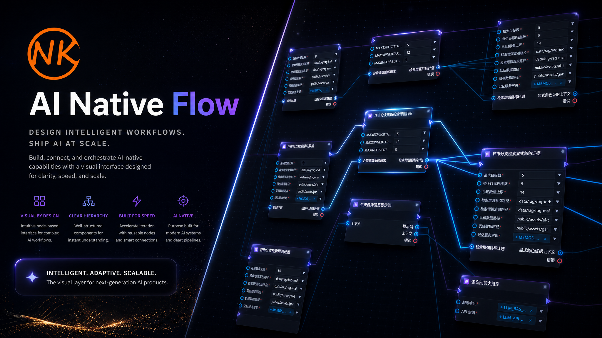

<p align="center">
  
</p>

<h1 align="center">NKG AI Flow</h1>

<p align="center">
  <a href="https://www.lfzxb.top/aigc-ai-native-flow/">技术博客：AI Native Flow</a>
</p>

> 面向 AI Agent 的可热更新 **Flow Runtime / Agent Harness**：让 AI 通过 `Flow Builder` 或
> `Graph Operation` 生成、修改、调试和热更新可控的 Agent Flow。

本文档作为项目入口，只覆盖 **项目目标 / 主要功能 / 安装与运行指引**；详细架构、规格和决策请看
[ARCHITECTURE.md](./ARCHITECTURE.md) 和 [docs/](./docs)。
通用 Workflow Runtime 控制流能力的收敛覆盖范围见
[docs/specs/workflow-runtime-coverage.md](./docs/specs/workflow-runtime-coverage.md)。

---

## 一、项目目标 && 主要功能

在保证 **生产可控** 的前提下，让 AI 安全地参与 Agent 工作流的构建与演进。核心要解决：

- **Flow 与节点逻辑可热更新**：版本化 Artifact + Registry 原子 Promote + Run Version Pinning，旧 Run 用旧 Artifact，新 Run 用新 Artifact，不依赖 runtime HMR。
- **多入口调用归一**：同一份 Flow 可通过 **HTTP / CLI / MCP / SDK / Studio** 调用，全部消费同一条 Runtime Event Bus。
- **稳定流式输出**：AI SDK / IDE SDK / 外部 CLI / sidecar 的输出统一归一为 `NodeEvent` 事件流，不用 `stdout` / `stderr` 承载语义 token。
- **AI 安全参与开发**：AI 可生成 Builder 逻辑、Graph Operation 或受限节点代码，但不能直接修改核心 Runtime；执行通过 Sandbox Adapter 受控。
- **配置可观测**：`VariableStore` 可枚举、可进入 Trace,Studio 与 Run Event 中可追踪每条值的来源。
- **可视化协作编辑**：Studio 不只是浏览器，还支持拖拽、增删节点和多端口连边，编辑动作以 `GraphOperation` 记录。

---

项目核心能力包括：

- **Flow 建模与校验**：提供 Flow IR、Schema、Validator 和类型化 Builder，保证 AI 生成或修改的图结构可验证、可落盘、可复现。
- **Runtime 执行与热更新**：通过 Run Manager、Scheduler、Registry 和 Event Bus 执行 Flow，支持版本化 Artifact、运行中版本固定和新版本 promote。
- **节点扩展机制**：业务节点通过 `defineNode` / `defineNodeFactory` 声明，node pack 可随 app 注册动态加载。
- **多入口调用**：同一份 Flow 可通过 HTTP / CLI / MCP / SDK / Studio 调用，并共享 Runtime API 与事件流。
- **配置管理**：内置 `VariableStore`，支持 `$var` 引用、可枚举、可追踪和运行级覆盖。
- **可移植 AI 能力**：内置 LLM 流式调用与多模态图片输入、SearXNG 联网搜索、OpenAI 兼容生图/改图节点；所有网络实现均支持宿主注入 `fetch`，可运行在 Node、浏览器与移动宿主。
- **Studio 可视化编辑**：提供 React + React Flow 编辑器，用于浏览、编辑、调试和观察 Flow 运行事件。
- **app 注册**：本项目自带 apps 自动发现；宿主项目可通过根 `anf.apps.json` 注册宿主自己的 apps。

各 Phase 的交付状态见 [ARCHITECTURE.md 第 7 节](./ARCHITECTURE.md#7-推荐实现路线)。

---

## 二、给 Coding Agent 使用本项目 Skill

仓库根目录的 [`nkg-ai-flow-skill/SKILL.md`](./nkg-ai-flow-skill/SKILL.md) 是给 Codex / Claude Code 等 coding agent 的开发规范入口（非运行时依赖），约束它们按本项目约定开发 Flow——优先用 `FlowBuilder` 而不是手写 JSON、优先组合内置节点、显式设计控制边/数据边/`context`、正确写 `anf.app.json` 等。完整规则见 SKILL.md，这里不展开。

> **节点逻辑和 flow 流程没有规范，就是没有 harness。** 小 demo 里随便组个 flow 没问题，但放进 hex-advisor 这种多分支 + RAG + LLM 评分的生产链路会立刻暴露问题（节点职责漂移、context 字段乱命名、LLM 失败兜底假数据、确定性候选被偷换成 LLM 推荐）。所以 SKILL.md 末尾的 **Flow Self-Audit 五子系统**（Instructions / State / Verification / Boundaries / Handoff，骨架借鉴自 [walkinglabs/learn-harness-engineering](https://github.com/walkinglabs/learn-harness-engineering) 的 `harness-creator`，但每条检查项都重写成了能在 PR diff 里被 grep / lint / topology audit 验证的 flow-specific 题目）和 **Flow Quality Patterns**（"LLM is judge, not recommender"、"hard-fail on formal path"、"item review only edits candidate-bound lists"、"no hard-coded entity names" 等硬规则）必须配套使用，不是可选项。

让 coding agent 接入的提示语：

```text
# 在本仓库内
请先读取并遵循 ./nkg-ai-flow-skill/SKILL.md（含末尾的 Flow Self-Audit 与 Flow Quality Patterns），
然后开发自定义 Flow:<目标 / 输入 / 输出 / 验收标准>。用 FlowBuilder，不要手写 Flow JSON。
完成后按 Flow Self-Audit 逐条对照,不通过的项当场修掉或写成 todo。

# 作为宿主项目的 submodule(./nkg-ai-flow/)
把上面路径换成 ./nkg-ai-flow/nkg-ai-flow-skill/SKILL.md 即可。
```

支持显式 skill 路径的工具可直接把 `nkg-ai-flow-skill/` 作为本地 skill 目录注入。

---

## 三、安装与推荐集成方式

### 3.1 直接开发本项目

直接修改 Runtime、Studio 或本项目自带 apps 时，在本仓库内安装依赖：

```bash
npm install
```

> 国内网络或公司内网拉取 npm 官方源较慢/失败时，建议在用户级配置中切换为公开镜像，**不要**在仓库内提交 `.npmrc`，避免污染团队环境：
>
> ```bash
> npm config set registry https://registry.npmmirror.com
> ```

直接在本仓库启动 Studio 或 HTTP runner 时，不需要根 `anf.apps.json`。loader 会自动扫描本项目自带的 `apps/*/anf.app.json`，有 `anf.app.json` 的 app 才参与注册。

新增本项目内置 app 时，把 app 放到 `apps/<app>/` 下，并在该目录提供 `anf.app.json`：

```json
{
  "name": "my-app",
  "flowDirs": ["flows"],
  "nodePacks": ["nodes/index.ts"]
}
```

这种方式主要用于开发和验证本项目自身能力；业务项目优先使用下面的 submodule 集成方式。

### 3.2 宿主项目推荐作为 submodule 使用

外部业务项目推荐把本项目作为 Git submodule 放在宿主仓库根目录，例如 `nkg-ai-flow/`：

```bash
git submodule add https://github.com/wqaetly/nkg-ai-flow nkg-ai-flow
git submodule update --init --recursive
```

宿主项目通过 `file:` 依赖引用需要的包，只引入实际用到的模块：

```json
{
  "dependencies": {
    "@ai-native-flow/builder-runner": "file:nkg-ai-flow/packages/builder-runner",
    "@ai-native-flow/flow-builder": "file:nkg-ai-flow/packages/flow-builder",
    "@ai-native-flow/runtime": "file:nkg-ai-flow/packages/runtime",
    "@ai-native-flow/node-sdk": "file:nkg-ai-flow/packages/node-sdk",
    "@ai-native-flow/variable-store": "file:nkg-ai-flow/packages/variable-store"
  }
}
```

然后在宿主项目根目录执行：

```bash
npm install
```

这种方式适合业务项目保持自己的源码、脚本、数据和部署结构，同时复用本项目的 Flow Builder、Runtime、节点注册与配置模块。

#### Runtime 宿主入口

`@ai-native-flow/runtime` 的包根是默认 portable Runtime。业务代码可以直接使用
`createRuntime()`，无需判断 Browser、WebView、Worker、Android 或 iOS；默认组合不含
任何 Node builtin，并使用可注入的 Store、HTTP、Secret、Tool、Hash 与 ID 能力。

```ts
import { createRuntime } from "@ai-native-flow/runtime";

const runtime = createRuntime({
  runStore,
  registryStore,
  artifactStore,
  fetch: hostFetch,
});
```

只有明确需要本机文件系统或子进程工具的 Node 服务、CLI、sidecar 才使用显式入口：

```ts
import { createNodeRuntime } from "@ai-native-flow/runtime/node";

const runtime = createNodeRuntime();
```

公开入口的语义如下：

| 入口 | 默认宿主能力 | 用途 |
|---|---|---|
| `@ai-native-flow/runtime` | portable 内存组合，无 Node builtin | 业务默认、Browser、WebView、Worker、移动端 |
| `@ai-native-flow/runtime/portable` | 与包根相同 | 需要强调宿主类型的基础设施代码 |
| `@ai-native-flow/runtime/browser` | portable 兼容别名 | 旧集成迁移 |
| `@ai-native-flow/runtime/node` | 文件 ArtifactStore、文件与进程 ToolHost | Node CLI、HTTP runner、desktop-power sidecar |

portable 与 Node 工厂都会自动启用 capability manifest。Flow 注册时即检查宿主是否支持
节点要求的网络、存储、文件或进程能力，业务层不需要重复编写平台分支。

#### 宿主 app 注册

业务项目推荐参考 `kesmj` 的集成方式：

```text
host-project/
├── nkg-ai-flow/              # git submodule
├── package.json              # file:nkg-ai-flow/packages/... 依赖
├── anf.apps.json             # 注册宿主 app
├── apps/<host-app>/anf.app.json
└── src/<flow-or-nodes>/
```

宿主根目录只用 `anf.apps.json` 注册宿主自己的 app：

```json
{
  "apps": [
    "apps/host-flow"
  ]
}
```

每个宿主 app 再提供自己的 `anf.app.json`，声明 Flow JSON / Builder 产物目录和节点包：

```json
{
  "name": "host-flow",
  "flowDirs": [
    "../../src/agent-flow"
  ],
  "nodePacks": [
    "../../src/agent-flow/nodes/index.ts"
  ]
}
```

注意事项：

- `nkg-ai-flow/` 只作为 runtime/tooling submodule，不要在宿主 `anf.apps.json` 里声明 submodule 路径；
- 宿主 `apps[]` 路径相对宿主 `anf.apps.json` 所在目录解析；
- app 内 `flowDirs[]` 和 `nodePacks[]` 路径相对该 app 的 `anf.app.json` 所在目录解析；
- 从宿主项目目录或其子目录启动 runner / sidecar，确保 loader 能向上找到宿主 `anf.apps.json`；
- loader 会按规范化绝对路径去重；没有 `anf.app.json` 的目录不会注册。

宿主项目如果使用 Builder 生成 Flow artifact，可在自己的脚本里调用 `@ai-native-flow/builder-runner`，把产物写到宿主自己的 `artifacts/flows` 或源码目录；本项目不要求宿主把业务 Flow 放进 submodule。

---

## 四、配置（内置环境变量模块）

项目使用内置环境变量模块管理运行时配置，不把 `.env` / `.env.local` 作为运行期配置模型：

- `VariableStore` 管理运行时变量，可枚举、可追踪、支持运行级覆盖；
- 各 app / test 通过 `bootstrapDefaults(...)` 声明允许注入的变量名；
- Flow / node config 通过 `$var` 引用运行时变量，而不是直接读取外部 env 文件。

进程环境变量只作为启动时输入源；进入运行时后，变量读取都通过 `VariableStore` 完成。

### 4.1 Flow 伴生环境文件规范

业务 Flow 的运行配置必须跟随 Flow artifact 放在同目录的伴生 JSON 文件中，不要使用 `.env.local` 或其他项目根目录 env 文件作为运行时配置来源。

命名规则：

- `src/agent-flow/hex-advisor.flow.json`
- `src/agent-flow/hex-advisor.flow.env.json`：可提交的默认变量、非敏感占位或 Studio 可见配置；
- `src/agent-flow/hex-advisor.flow.local.env.json`：本机真实配置和私有变量，必须被 git ignore。

开发准则：

- 新增或修改 Flow 时，同步创建或更新对应的 `*.flow.local.env.json`，并确认 `.gitignore` 覆盖 `*.flow.local.env.json`；
- Flow JSON / Builder config 只写 `$var.NAME` 这类引用，不把真实 key、URL 或模型配置硬编码进图；
- runtime / CLI / smoke test 应基于 `createFlowScopedStores({ flowPath })` 或等价封装读取伴生文件，确保 Studio、HTTP runner 和本地验证消费同一套配置；
- `.env.example` 只作为人工说明或迁移参考，不能作为项目运行时读取路径；
- 缺少必需变量或仍是占位值时应直接失败，不能用 mock、空字符串、默认值或本地兜底逻辑继续执行。

---

## 五、运行示例

### 5.1 Hello Agent

构建一个最小 `text_input -> agent` Flow，用于展示 agent 对自然语言任务的意图理解，以及通过文件工具完成桌面文件写入的链路：

```bash
npm run app:helloagent
```

对应入口为 [`apps/hello-agent/build.ts`](./apps/hello-agent/build.ts)，同目录的 `invoke.ts` 可运行一个自包含的 agent 文件写入示例。

### 5.2 Studio Browser

同时启动后端 sidecar（HTTP transport）和前端 Vite dev server：

```bash
npm run studio:dev
```

- 前端：<http://127.0.0.1:3000>
- Studio sidecar：优先使用 <http://127.0.0.1:5173>

`studio:dev` 会先选择一个实际可绑定的 sidecar 端口，再把同一个 URL 注入前端。
例如 Windows 的 WinNAT/Hyper-V 保留了 `5173` 时，sidecar 可能回退到 `5175`，
前端会自动连接 `5175`，无需手动追加 `?sidecar=`。终端启动日志会同时打印最终的
前端和 sidecar URL。

也可以分开启动：

```bash
npm run studio:dev:backend
npm run studio:dev:frontend
```

### 5.3 通用 HTTP 服务

通用 HTTP Runner 与 Studio sidecar 是两个独立入口。Runner 默认监听
<http://127.0.0.1:8787>；它不会替代 Studio 开发模式使用的 sidecar 端口。

仓库内只需一条命令即可启动面向多 Flow 的通用 HTTP 服务：

```bash
npx tsx packages/transports/http-runner/src/bin.ts
```

`http-runner` 启动时会：

1. 自动扫描本项目自带的 `apps/*/anf.app.json`；
2. 如果从 CWD 向上找到宿主 `anf.apps.json`，再读取其中的宿主 `apps[]`；
3. 合并两类 app 来源并去重；
4. 对每个已注册 app 读取 `anf.app.json`；
5. 动态 `import()` 每个 node pack，并装入 Runtime 的 `NodeTypeRegistry`；
6. 递归扫描每个 flow root 下的 `*.json`，按 graph 自身的 `flow.id` 注册并 promote 到 `runtime.registry`；
7. 如果不同 graph 出现重复 `flow.id`，启动时报错并退出。

启动成功后会打印已注册的 flow，示例：

```text
AI Native Flow HTTP runner listening on http://127.0.0.1:8787
Registered flows:
- skill_to_flow (/flows/skill_to_flow/invoke)
```

服务端暴露的主要端点：

| 端点 | 用途 |
|---|---|
| `GET /` | 列出 manifest 中所有已注册 Flow 与端点 |
| `POST /flows/:flowId/invoke` | 同步执行，返回 `{ runId, status, output }` |
| `GET /flows/:flowId/stream` | SSE 流式执行 |
| `POST /flows/:flowId/nodes/:nodeId/invoke` | 子图同步执行 |
| `GET /runs/:runId` | 查询 RunRecord |
| `GET /runs/:runId/events` | 查询 NodeEvent 列表，支持 `cursor=` / `limit=` |
| `GET /runs/:runId/replay` | SSE 回放历史事件 |
| `POST /runs/:runId/cancel` | 取消 Run |

最简单的同步调用：

```bash
curl -s http://127.0.0.1:8787/flows/skill_to_flow/invoke \
  -H "content-type: application/json" \
  -d '{"input":{"skill_content":"---\nname: demo\ndescription: Demo skill\n---\n# 工作流\n1. 接收输入\n2. 输出结果"}}'
```

带 `nodeOverrides` 透传节点 config（等价于 Langflow `tweaks`，仅本次调用生效）：

```bash
curl -s http://127.0.0.1:8787/flows/skill_to_flow/invoke \
  -H "content-type: application/json" \
  -d '{
    "input": {"skill_content": "---\nname: demo\ndescription: Demo skill\n---\n# 工作流\n1. 接收输入\n2. 输出结果"},
    "nodeOverrides": {
      "skill_planner": { "config": { "model": "gpt-4o-mini" } }
    }
  }'
```

订阅 SSE 实时事件：

```bash
curl -N "http://127.0.0.1:8787/flows/skill_to_flow/stream?input=%7B%7D"
```

查询历史 Run 与事件：

```bash
curl -s http://127.0.0.1:8787/runs/<runId>
curl -s http://127.0.0.1:8787/runs/<runId>/events
```

如果要在宿主项目中使用自己的 Flow，需要通过宿主 `anf.apps.json` 注册 app。详细规则见 §3.2。

---

## 六、常用开发命令

| 命令 | 说明 |
|---|---|
| `npm install` | 安装所有 workspace 依赖 |
| `npm run build` | 构建全部 workspace（`--if-present`） |
| `npm test` | 运行 Vitest 单元 / 集成测试 |
| `npm run typecheck` | 全仓 `tsc --noEmit` 类型检查 |
| `npm run app:helloagent` | 运行 Hello Agent app |
| `npx tsx packages/transports/http-runner/src/bin.ts` | 启动通用 HTTP 服务 |

---

## 七、仓库结构导航

```text
.
├── ARCHITECTURE.md          # 架构总览与文档入口
├── README.md                # 本文档
├── apps/*/anf.app.json      # app-local 清单：声明本 app 的 flowDirs[] 与 nodePacks[]
├── packages/
│   ├── flow-ir/             # Flow 图模型与 Schema
│   ├── runtime/             # Runtime 核心
│   ├── transport-http/      # HTTP handler 与 SSE
│   └── studio/              # React + React Flow 编辑器库
├── apps/
│   ├── studio/              # Vite 前端 + Node sidecar
│   ├── skill-to-flow/       # Skill 到 Flow 的生成应用
│   └── hello-agent/         # text_input -> agent 最小 app
└── docs/
    ├── specs/               # 规格文档
    ├── decisions/           # 架构决策记录
    └── implementation/      # 实现指南与 Roadmap
```

---

## 八、文档导航

- [ARCHITECTURE.md](./ARCHITECTURE.md)：项目目标、核心原则、总体架构、模块边界
- [docs/implementation/ai-implementation-guide.md](./docs/implementation/ai-implementation-guide.md)：默认技术栈、实现顺序、AI 禁止事项
- [docs/implementation/roadmap.md](./docs/implementation/roadmap.md)：Phase 0+ 的目标与 Definition of Done
- [docs/specs/](./docs/specs)：Flow Schema / Runtime / Streaming / Studio / Sandbox / Variable Store 等规格
- [docs/decisions/](./docs/decisions)：Hot Swap / Event Channel / Node-first / Schema Versioning 等 ADR
