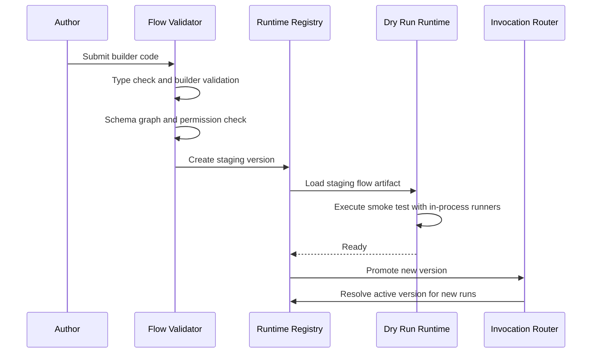
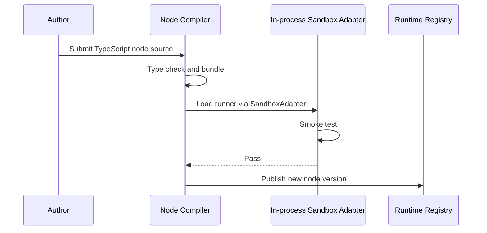

# Runtime Execution

> This document was split from [ARCHITECTURE.md](../../ARCHITECTURE.md).

## 5. Flow Runtime 设计

### 5.1 Flow Artifact

Flow Artifact 是经过 Builder 导出、校验、规范化、可运行的 Flow 描述。

包含：

- Flow metadata
- Flow version
- Schema version
- Input / output schema
- Normalized graph
- Node instance index
- Node type references
- Port definitions
- Edge endpoint index
- Layout metadata
- Node definitions
- Node logic references
- Permission manifest
- Retry / timeout policy
- Checkpoint policy

示例目录：

```text
.runtime/artifacts/flows/research-flow/v3/
  flow.json
  manifest.json
  nodes.json
```

### 5.2 Node Logic Artifact

TypeScript 节点逻辑在发布前编译为独立 Artifact。

示例目录：

```text
.runtime/artifacts/nodes/extract-keywords/v2/
  index.js
  manifest.json
  package.json
```

Manifest 示例：

```json
{
  "id": "extract-keywords",
  "version": "v2",
  "entry": "index.js",
  "inputSchema": {},
  "outputSchema": {},
  "permissions": ["text.process"],
  "timeoutMs": 10000,
  "sandbox": {
    "tier": "inProcess"
  }
}
```

### 5.3 Runtime Registry

Runtime Registry 负责维护当前激活版本。

概念模型：

```ts
interface FlowVersionRef {
  flowId: string;
  version: string;
  artifactHash: string;
  status: "staging" | "active" | "draining" | "archived";
}
```

逻辑上维护：

```text
activeFlows:
  research-flow -> research-flow@v3
  coding-agent  -> coding-agent@v8
```

热更新时只做原子指针切换。


### 5.5 Invocation Router、Run Manager 与 Scheduler

Flow Runtime 不应由 Registry 直接驱动执行。Registry 只负责版本索引和指针切换，真正的执行链路应拆成几个明确组件。

推荐职责边界：

```text
HTTP / CLI / MCP / SDK / Studio
        ↓
Invocation Router
        ↓
Run Manager
        ↓
Scheduler
        ↓
Execution Engine
        ↓
Node Runner / Sandbox Adapter
        ↓
Node Event Channel
        ↓
Runtime Event Bus
```

| 组件 | 职责 |
|---|---|
| Invocation Router | 接收 HTTP、CLI、MCP、SDK 调用，解析输入，选择当前 active Flow Version |
| Run Manager | 创建 Run，固定 Flow Version，维护 Run 状态、取消、重放和恢复入口 |
| Scheduler | 根据图结构、端口状态、Join / Fork / Retry / Timeout 策略决定下一个可执行节点 |
| Execution Engine | 负责节点生命周期、输入组装、输出写入、错误分支和 Checkpoint |
| Node Runner / Sandbox Adapter | 通过当前 in-process adapter 执行内置节点和插件节点，统一 `try/catch`、取消、timeout、inflight 与 drain 语义 |
| Node Event Channel | 接收节点生命周期事件、AI 流事件、工具调用事件和错误事件 |
| Runtime Event Bus | 统一排序、持久化、广播、回放和传输适配 |

关键约束：

- Registry 只提供 `flowId -> activeVersion` 的原子查询和切换，不直接保存运行中调度状态。
- 每个 Run 启动时由 Run Manager 读取 active version，并写入 Run Record，后续执行不得隐式跟随 active pointer 改变。
- Scheduler 必须只基于 Run 固定的 Flow Artifact、Run State 和 Event Cursor 做决策。
- Transport Adapter 不直接读取节点进程输出，只读取 Runtime Event Bus。
- Studio 调试、CLI 渲染、MCP progress 和 HTTP SSE 必须看到同一条事件序列。

### 5.6 Flow Execution Semantics

Flow 的图结构必须配套明确执行语义，否则多端口、流输出、并行和热更新都会在实现阶段变成隐式约定。

#### 节点触发规则

- `start` 节点由 Invocation Router 创建 Run 后触发，是 Flow 的默认入口。
- 普通节点在所有 `required: true` 的 `data` 输入满足后，且至少一个 `control` / `event` 触发到达后进入 ready 状态。
- 没有 `control` 输入的纯数据节点可以由数据齐备触发，但必须显式声明 `trigger: "data_ready"`。
- `stream` 输入默认不触发节点完成，只表示下游可消费增量事件；是否用 stream 驱动下游节点必须由 Node Type 显式声明。
- `error` 输入只接收上游错误分支，不能和普通 `control` 输入隐式合并。

#### Fork、Join 与并行

| 场景 | 默认语义 | 可配置项 |
|---|---|---|
| 一个输出连接多个下游 | fan-out，所有下游都获得同一份输出引用 | 是否复制大对象、是否异步调度 |
| 多个输入连接同一端口 | 默认非法，除非端口声明 `multiple: true` | merge 策略、顺序策略、窗口策略 |
| 多个必填输入 | all-join，全部到达后执行 | any-join、race、quorum |
| `parallel` 节点 | 并行启动多个分支，等待全部成功 | fail-fast、partial success、timeout |
| 条件分支 | 只激活匹配分支 | default branch、else branch、exhaustive check |

#### 循环与递归

- 默认允许有向无环图，循环必须显式声明 `loop` 或 `subflow` 节点。
- 循环必须配置最大迭代次数、退出条件和超时。
- 每次循环迭代应生成新的 iteration scope，避免覆盖上一轮输出。
- Replay 时必须能按 `runId + nodeId + attempt + iteration` 定位具体执行。

#### 取消、超时与重试

- Run 取消由 Run Manager 发起，通过 `AbortSignal` 向 Scheduler、Node Runner 和 Adapter 传播。
- 节点超时应转为标准 `node_error`，并根据错误端口或 retry policy 继续调度。
- 重试必须递增 `attempt`，同一 attempt 内 `seq` 单调递增。
- Runtime 必须区分 retry 产生的重复 stream 与原 attempt 的 stream，避免 Studio 或 CLI 混合展示。
- 非幂等节点默认不自动重试，除非 Node Type 声明 `idempotent: true` 或提供补偿逻辑。

#### 节点完成条件

一个节点只有在满足以下条件后才进入 `finished`：

- `run()` 返回，或同进程 runner 返回 `NodeResult`。
- 该节点打开的所有 `stream` 都已 `stream_close` 或 `stream_error`。
- 必要的输出数据已经写入 Run State 或 Artifact Store。
- Runtime 已经持久化 `node_finished` 事件。

`node_finished` 不代表整个 Flow 完成。Flow 只有在所有可达分支完成、取消或进入终止状态后，才能写入 `run_finished`。

#### Flow Input / Output Validation Lifecycle

Flow Artifact 的 `inputSchema` 和 `outputSchema` 不是可选装饰，而是 Run 生命周期中两次强制校验的依据。Runtime 必须显式区分校验时机、错误归属和持久化语义，避免 AI 生成的 Flow 在生产环境因输入缺字段或输出形状漂移而导致难以追踪的失败。

校验时机：

| 阶段 | 校验对象 | 触发方 | 失败语义 |
|---|---|---|---|
| Build-time | `inputSchema` / `outputSchema` 自身合法性 | Flow Validator | 拒绝 Promote，Artifact 不进入 `staging` |
| Pre-run | Invocation 输入 vs `inputSchema` | Invocation Router | Run 不创建，返回 `flow_input_invalid`，不写 Run Record |
| Pre-node | 节点输入 vs Node Type `inputSchema` | Execution Engine | 触发 `node_error`，进入 error 端口或 retry policy |
| Post-node | 节点输出 vs Node Type `outputSchema` | Execution Engine | 触发 `node_error`，节点不进入 `finished` |
| Pre-finish | 聚合输出 vs Flow `outputSchema` | Run Manager | Run 不进入 `succeeded`，写入 `run_failed` 和结构化错误 |
| Replay | 旧 Run 输入 vs 新 Schema | Run Manager + Migration | 默认拒绝 replay，除非提供 `FlowMigration.migrateInput` |

关键约束：

- **Pre-run 校验必须在创建 Run 之前完成**。失败时不应消耗 Run ID、不应写入 Run Event Store，仅在 transport 层返回结构化错误，避免污染审计与 trace。
- **Pre-finish 校验失败必须落地**。Run 已经创建并产生事件，因此必须写入 `run_failed`，并把校验错误以 `RuntimeError` 形式持久化到 Run Event Store，否则会出现 Run 永远停在 `running` 的悬挂态。
- **节点级输入校验由 Execution Engine 统一执行**，节点 `run()` 内部不应再次手写 schema 校验，避免重复实现与不一致。
- **校验结果必须是 `RuntimeError`**（见 [Error Model](./error-model.md)），`kind` 固定为 `validation`，`code` 形如 `flow.input.invalid` / `node.output.invalid` / `flow.output.invalid`，并附带 JSON Pointer 指向首个错误字段。
- **大对象 / Artifact 字段不应整体进入 schema 校验 payload**。校验只对 `ArtifactRef` 元数据生效，避免反复读取 GB 级附件。
- **Secret 字段在校验前必须脱敏**。即使校验失败需要返回 partial input，错误对象中也不能携带 Secret 明文。
- **校验成本应可控**。AI 生成 Schema 容易嵌套过深或使用全局 `$ref` 形成循环，Runtime 应在 Build-time 阶段对 Schema 复杂度做静态预算（最大深度、最大字段数、最大 JSON 大小），超出阈值的 Schema 应在 Promote 前被拒绝。
- **校验器必须是确定性的、纯函数式的**，不允许在校验过程中调用 LLM、Tool 或读取外部状态，否则会破坏 Replay 语义。

错误事件示例：

```json
{
  "kind": "node_error",
  "payload": {
    "error": {
      "kind": "validation",
      "code": "node.input.invalid",
      "retryable": false,
      "userVisible": true,
      "details": {
        "schemaPath": "#/properties/topic",
        "instancePath": "/topic",
        "expected": "string",
        "received": "undefined"
      }
    }
  }
}
```

### 5.7 State、Data Flow 与 Artifact Model

节点之间不应只靠内存对象传值。Runtime 需要同时支持小型结构化数据、大对象、流式数据和可回放状态。

推荐数据分层：

| 数据类型 | 存储方式 | 说明 |
|---|---|---|
| Small structured data | Inline JSON | 适合配置、短文本、结构化字段，进入 Run State |
| Large text / binary / file | Artifact reference | 适合长上下文、图片、patch、报告、模型输出全文 |
| Streaming data | Runtime Event Bus | 通过 `stream_delta`、`stream_artifact` 输出，最终可落 Artifact |
| Secret / credential | Secret Store reference | 不进入 Flow JSON、Run State、Trace payload |
| Derived trace view | Trace Store | 从 Run Event Stream 派生，便于查询和可视化 |

节点输出建议统一写成：

```ts
interface NodeOutputEnvelope {
  data?: Record<string, unknown>;
  artifacts?: Record<string, ArtifactRef>;
  events?: NodeEvent[];
  metadata?: Record<string, unknown>;
}

interface ArtifactRef {
  id: string;
  kind: "text" | "json" | "file" | "patch" | "image" | "binary";
  hash: string;
  uri: string;
  size?: number;
  contentType?: string;
}
```

关键原则：

- 边上传递的是 value reference，而不是必须复制完整 payload。
- 小数据可以内联，大数据必须落 Artifact Store 后用 `ArtifactRef` 传递。
- Stream 是运行时事件，不等同于最终输出；需要持久结果时必须在 `stream_close` 或节点完成时生成 Artifact。
- Checkpoint 保存 Run State snapshot、event cursor、artifact refs 和 scheduler cursor，不保存 Secret 明文。
- Replay 默认从事件和 checkpoint 恢复；是否重新调用 LLM / Tool 必须由 replay policy 决定。
- Artifact 应不可变，使用 hash 校验，仍被 active / running Run 引用时不得 GC。

### 5.8 Artifact 生命周期

Flow Artifact、Node Logic Artifact 和运行时 Artifact 都应采用不可变发布模型。

```text
created -> staging -> active -> draining -> archived -> gc-candidate -> deleted
```

生命周期规则：

- `staging` Artifact 可以被 dry run、smoke test 和 policy check 读取，但不能承载正式 Run。
- `active` Artifact 可被新 Run 引用。
- `draining` Artifact 不再接收新 Run，但仍服务已绑定旧版本的 Run。
- `archived` Artifact 可用于 Replay、Diff、Audit 和 Rollback。
- 只有没有 active pointer、没有 running Run、没有 retention 要求的 Artifact 才能进入 `gc-candidate`。
- 删除前必须校验引用计数、hash、版本索引和审计策略。

---


## 7. 热更新流程

### 7.1 新增或替换 Flow



### 7.2 替换 TypeScript 节点逻辑



### 7.3 Run Version Pinning

每个 Run 启动时固定 Flow Version。

```json
{
  "runId": "run_123",
  "flowId": "research-flow",
  "flowVersion": "v3",
  "status": "running"
}
```

即使 `research-flow@v4` 发布，`run_123` 仍然继续运行 `v3`。

### 7.4 Checkpoint Migration

如果需要让运行中的 Flow 在 Checkpoint 后迁移到新版本，必须显式定义 Migration。

```ts
interface FlowMigration {
  from: string;
  to: string;
  migrateState(oldState: unknown): unknown;
  resumeNode?: string;
}
```

默认策略是不迁移，保证稳定性和可复现性。

---


